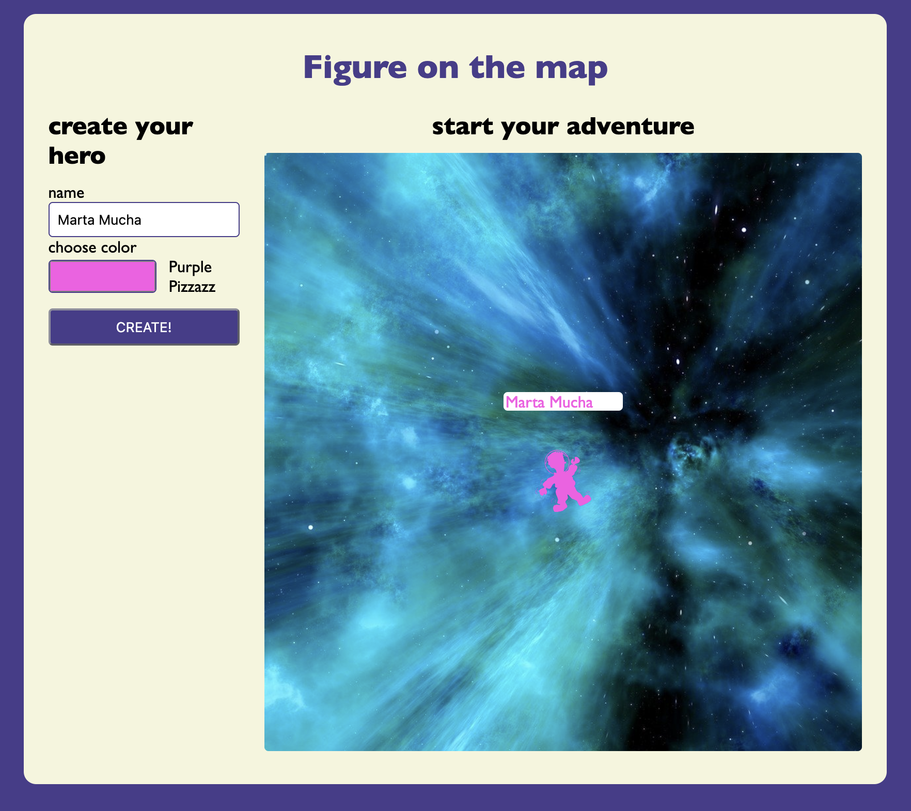

# Figure on the map

Application in React that allows the user to enter character parameters in the form on the left and then display that character on a static map on the right. The user can control the character using the arrow keys on the keyboard, and the name entered in the form is displayed above the character.

